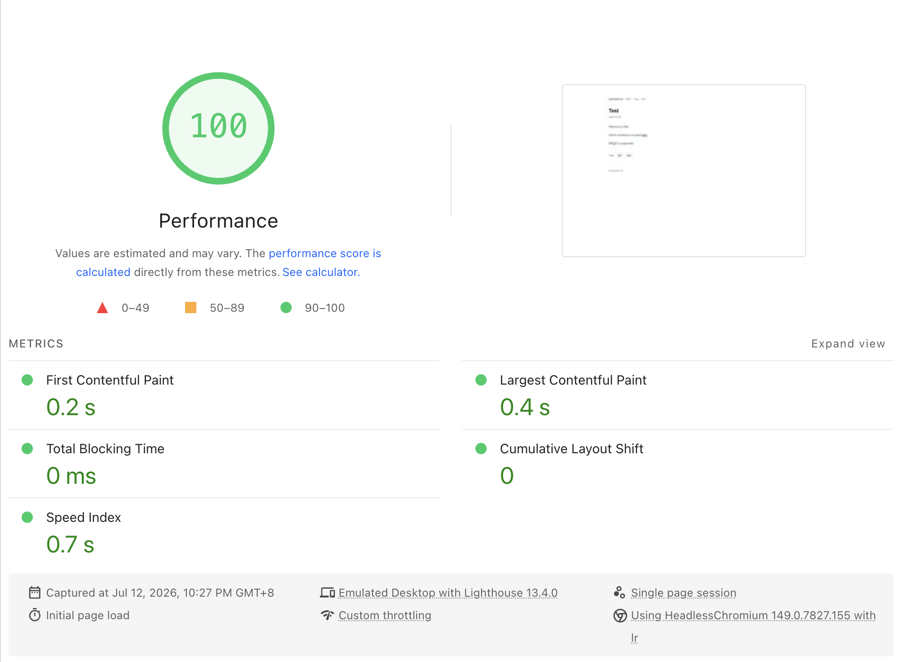

# ftle

[](https://github.com/boomzero/ftle/actions/workflows/ci.yml)
[](LICENSE)

A dynamically-editable blog engine that runs entirely on Cloudflare's free tier — no server to patch, no database to babysit, no monthly hosting bill.

Most self-hosted blog engines (WordPress and friends) trade you a web-based editor for a PHP server, a MySQL instance, plugin security patches, and a hosting bill. ftle keeps the part that's actually useful — write and publish from a browser, from anywhere — and throws away the rest: it's a single Cloudflare Worker and a D1 (SQLite) database, deployed with one command, with nothing to patch because there's no server process to compromise.

- **Free to run.** Fits comfortably in Cloudflare's free Workers + D1 tier. Edge cache hits skip the Worker and the database entirely — no CPU time billed, no D1 read — so only a cache miss (a new post, or the first reader after a purge) touches either. Saving a post purges just the affected cache tags, so edits still show up immediately; there's no stale-cache tradeoff. (Cache hits still count toward the Free plan's 100,000 requests/day quota — this isn't literally unlimited traffic, just cheap traffic.)
- **Fast.** Reader-facing pages ship **0 bytes of JavaScript** and **≤ 14KB compressed HTML**, served from Cloudflare's edge cache. A regression test enforces this budget on every commit — see [Performance budget](#performance-budget).
- **Small attack surface.** No PHP, no plugin ecosystem, no database credentials to leak. The admin panel is gated by [Cloudflare Access](#3-configure-cloudflare-access) — Cloudflare verifies your identity before a request ever reaches the Worker.
- **Edit from anywhere.** A web-based Markdown editor with live LaTeX math preview — no local tooling, no build step, no static-site regeneration.

## Features

- Markdown posts with raw HTML passthrough and server-side [KaTeX](https://katex.org) math rendering (`$inline$` and `$$display$$`)
- Draft / unlisted / listed post visibility
- Image uploads from the editor — button or paste — via a pluggable external host (see [Image uploads](#image-uploads))
- Tags, an Atom feed (`/rss.xml`), `sitemap.xml`, and `robots.txt`
- OpenGraph, Twitter Card, and JSON-LD `BlogPosting` metadata on every post
- Dark-mode-aware styling with Tailwind, inlined into each page (no external stylesheet)
- Cache-tag-based CDN invalidation — edits go live immediately, not after a TTL

## Quickstart

Setup is a loop, not a straight line: `/admin*` is gated by [Cloudflare Access](https://developers.cloudflare.com/cloudflare-one/applications/), and Access needs a real hostname to attach a policy to — one that only exists once the Worker is deployed and a domain is pointed at it. So `ACCESS_TEAM_DOMAIN` and `ACCESS_AUD` can't be filled in up front; they start as placeholders, and you come back and set the real values once Access exists. Four steps:

### 1. Deploy the Worker

**Option A: Deploy to Cloudflare button**

[](https://deploy.workers.cloudflare.com/?url=https://github.com/boomzero/ftle)

This clones the repo into your own GitHub account, provisions a D1 database, and deploys the Worker in a few clicks. The `deploy` script (`package.json`) runs `wrangler d1 migrations apply DB --remote` before `wrangler deploy`, so the database schema is applied automatically as part of that same build — nothing extra to run.

The wizard's "Create and deploy" step prompts for `ACCESS_TEAM_DOMAIN` and `ACCESS_AUD` alongside the other `vars`. Leave them as their pre-filled placeholders (`https://your-team.cloudflareaccess.com` and `replace-with-your-access-application-aud-tag`) — you don't have real values yet, and won't until step 3. `/admin` stays unprotected (or outright broken, if the placeholders don't parse as valid config) until you finish step 4.

**Option B: Manual setup**

1. `npm install`
2. Create the D1 database: `npx wrangler d1 create ftle` — copy the returned `database_id` into `wrangler.jsonc`'s `d1_databases[0].database_id`.
3. Apply migrations locally: `npm run migrate:local`
4. Set the non-Access Worker vars in `wrangler.jsonc` (`vars`) — see [Configuration](#configuration) below. Leave `ACCESS_TEAM_DOMAIN`/`ACCESS_AUD` as placeholders for now.
5. Generate types: `npx wrangler types`
6. Generate the self-hosted KaTeX assets: `npm run prepare:katex`
7. `npm run dev` to try it locally, then `npm run deploy` when you're ready to go live (requires Wrangler ≥ 4.69.0).

### 2. Attach your domain

In the Cloudflare dashboard, go to **Workers & Pages → your Worker → Settings → Domains & Routes → Add → Custom Domain**, and enter the domain you want the blog to live on. This requires the domain to already be an active zone on your Cloudflare account (add it first via **Websites → Add a domain** if it isn't yet). This step is also what gives Access a real hostname to attach a policy to — which is why it has to happen before step 3.

### 3. Configure Cloudflare Access

`/admin*` isn't protected by a username/password login — it's protected by Cloudflare Access, which sits in front of the Worker and only lets a request through after Cloudflare itself has verified your identity. The Worker additionally verifies the `Cf-Access-Jwt-Assertion` JWT in-process via [`jose`](https://github.com/panva/jose) against Access's public keys (`src/auth/access.ts`) as defense in depth, but Access is the actual gate.

1. **Create the application.** In the Cloudflare dashboard, go to **Zero Trust → Access controls → Applications → Add an application → Self-hosted**. This is a self-hosted, DNS-routed app (not a "Private" app requiring the WARP client) — visitors reach it through normal HTTPS. Under **Add public hostname**, pick the domain you attached in step 2 and set the path to `/admin*` so the policy covers the whole admin panel.
2. **Add an Allow policy restricted to your email.** On the same screen, add a policy with **Action: Allow** and an **Include** rule of type **Emails**, with your email address as the value. Use the exact-match **Emails** selector, not **Emails ending in** a domain — the latter would let anyone with an email at that domain request a login code.
3. **Leave One-Time PIN as the login method** (it's on by default) unless you already have an identity provider configured — no extra signup service is required for a single-author blog.
4. **Save the application**, then find its **AUD tag**: back in **Access controls → Applications**, select your app, open **Configure**, and copy the **Application Audience (AUD) Tag** from the Overview/Additional settings panel.
5. **Find your team domain**: **Zero Trust → Settings → Custom Pages** (or **General**) shows your **Team name and domain**, in the form `https://<your-team>.cloudflareaccess.com`.

You now have real values for both blanks.

### 4. Fill in the blanks

Paste the AUD tag and team domain from step 3 into `ACCESS_AUD` and `ACCESS_TEAM_DOMAIN` **in `wrangler.jsonc`**, then get that change deployed:

- **Deployed via the button?** You have a real GitHub repo (that's what the button created) — edit `wrangler.jsonc` there, either locally or straight in GitHub's web editor, and commit to your production branch. Workers Builds redeploys automatically on push.
- **Deployed manually?** Edit `wrangler.jsonc`, then run `npx wrangler deploy` (or `npm run deploy`).

Don't take the shortcut of setting these two as plaintext vars in **Settings → Variables and Secrets** instead of editing the file. It looks like it works — the change applies immediately — but Wrangler resets a Worker's vars to exactly what's in `wrangler.jsonc` on every deploy. Since the file still has the placeholders, the *next* deploy (a future ftle update, a dependency bump, anything that triggers Workers Builds or a manual `wrangler deploy`) silently reverts `ACCESS_AUD`/`ACCESS_TEAM_DOMAIN` and breaks `/admin` again, with no obvious cause. Keep `wrangler.jsonc` as the source of truth for these two values, not the dashboard.

Visiting `/admin` should now redirect you through a Cloudflare-hosted login page before the Worker ever sees the request.

No other secrets are required — there's no client secret, API token, or session cookie for the Worker to manage.

## Configuration

All configuration lives in `wrangler.jsonc`'s `vars` block — no secrets, no `.env` file required.

| Var | Purpose |
|---|---|
| `SITE_URL` | Canonical origin, e.g. `https://example.com` — used to build absolute URLs, RSS, and sitemap entries |
| `SITE_TITLE` | Site name, shown in the nav and page titles |
| `SITE_DESCRIPTION` | Default meta description |
| `SITE_AUTHOR` | Author name, used in feed/JSON-LD metadata |
| `SITE_NAV_LINKS` | Optional extra nav links, as `Label\|URL` pairs separated by commas, e.g. `Twig\|https://twig.example.com,Sinv\|https://sinv.example.com`. Leave empty for no extra links. |
| `IMAGE_UPLOAD_URL` | Base URL of the image-hosting service the editor uploads to — see [Image uploads](#image-uploads). Defaults to `https://image.langningchen.com`. |
| `ACCESS_TEAM_DOMAIN` | Your Cloudflare Access team domain — see below |
| `ACCESS_AUD` | Your Access application's AUD tag — see below |

## Image uploads

The admin editor can upload images straight from the browser — via an "Insert image" button, or by pasting a screenshot directly into the source textarea. ftle has no built-in object storage (no R2, no KV), so uploads go straight from the browser to an external image-hosting service configured via `IMAGE_UPLOAD_URL`.

The default, `https://image.langningchen.com`, is a hosted instance of [langningchen/Image](https://github.com/langningchen/Image) (GPL-3.0) — a small Cloudflare Worker that stores uploaded images in a private GitHub repo and serves them back over HTTP. ftle uses it purely as a hosted HTTP API (no code from that project is vendored into this repo); many thanks to its author for letting ftle's editor use it, credited next to the upload button in the admin UI.

Uploaded images live on that external host indefinitely — deleting a post, or removing an image reference from its source, does not delete the image from the host. If you'd rather not depend on someone else's instance, point `IMAGE_UPLOAD_URL` at your own deployment of [langningchen/Image](https://github.com/langningchen/Image) (or a compatible host exposing the same `POST /upload` / `GET /:id` API).

## Architecture

One Cloudflare Worker, one D1 (SQLite) database. No KV, no R2, no queues, no build step for content.

Posts render **at write time**, not read time: saving a post runs Markdown ([`marked`](https://github.com/markedjs/marked), with raw HTML passed through) and KaTeX server-side once, storing both the original `source` and the pre-rendered HTML in D1. The read path is then just: edge cache hit → serve; miss → one indexed D1 query → wrap in the layout template → serve and populate the cache. Nothing is ever rendered on a reader's request.

The single trusted author is the security model for content: HTML is intentionally *not* sanitized (you're the only one who can save a post, and that's gated by Cloudflare Access), which is what lets raw HTML and math pass through untouched without a client-side sanitizer or extra request.

## Performance budget

Enforced by a regression test (`tests/perf/page-weight.test.ts`), not just a guideline:

| Metric | Budget |
|---|---|
| JavaScript on reader-facing pages | 0 bytes |
| Blocking external requests | 0 — CSS is inlined into the HTML |
| Typical post page, compressed | ≤ 14KB |

Admin pages are exempt — they may use minimal JS for the editor.



*A Lighthouse audit of a post page on a live deployment, captured 2026-07-12. Your own numbers will vary with content and network conditions — [run your own audit](https://pagespeed.web.dev) to check.*

## Commands

```sh
npm test               # full suite (vitest + @cloudflare/vitest-pool-workers)
npm run dev             # wrangler dev with local D1
npm run typecheck       # tsc --noEmit
npm run migrate:local   # apply D1 migrations to local dev DB
npm run migrate:remote  # apply D1 migrations to the deployed DB
npm run deploy           # apply pending remote migrations, then wrangler deploy
```

## Redeploying

Once you've done the [Quickstart](#quickstart) once, later deploys are just `npm run deploy` — applies any pending remote D1 migrations, then deploys the Worker (requires Wrangler ≥ 4.69.0). No cache-purge secrets are needed — this project uses Cloudflare's native Workers Caching (`"cache": { "enabled": true }` in `wrangler.jsonc`), with `ctx.cache.purge()` called in-process on save/delete/rerender via cache-tag-based invalidation.

## Known limitations

Explicitly out of scope for v1: comments, search, and multi-author support. KaTeX assets are self-hosted but not glyph-subsetted yet (loaded only on pages containing math, so this doesn't affect the 14KB budget on pages without it).

## License

[MIT](LICENSE)
